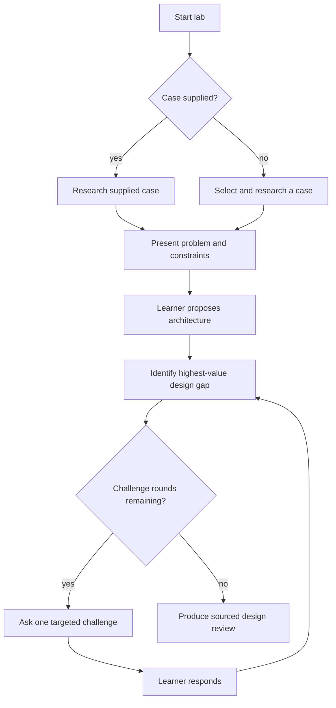
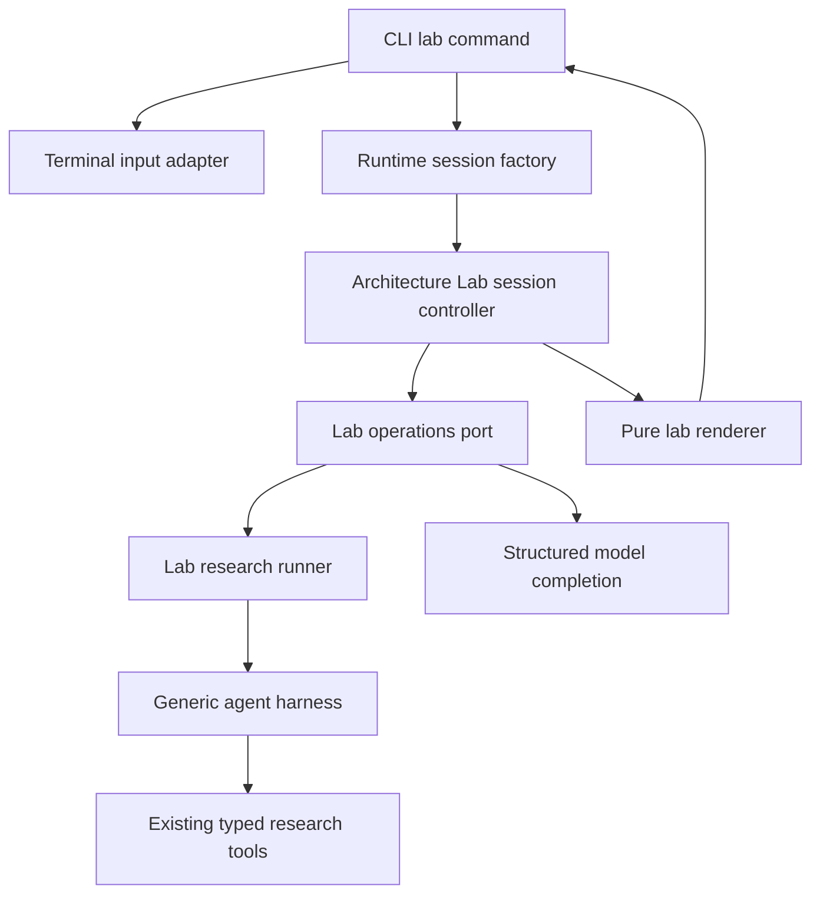
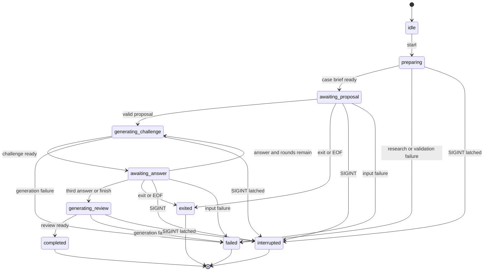
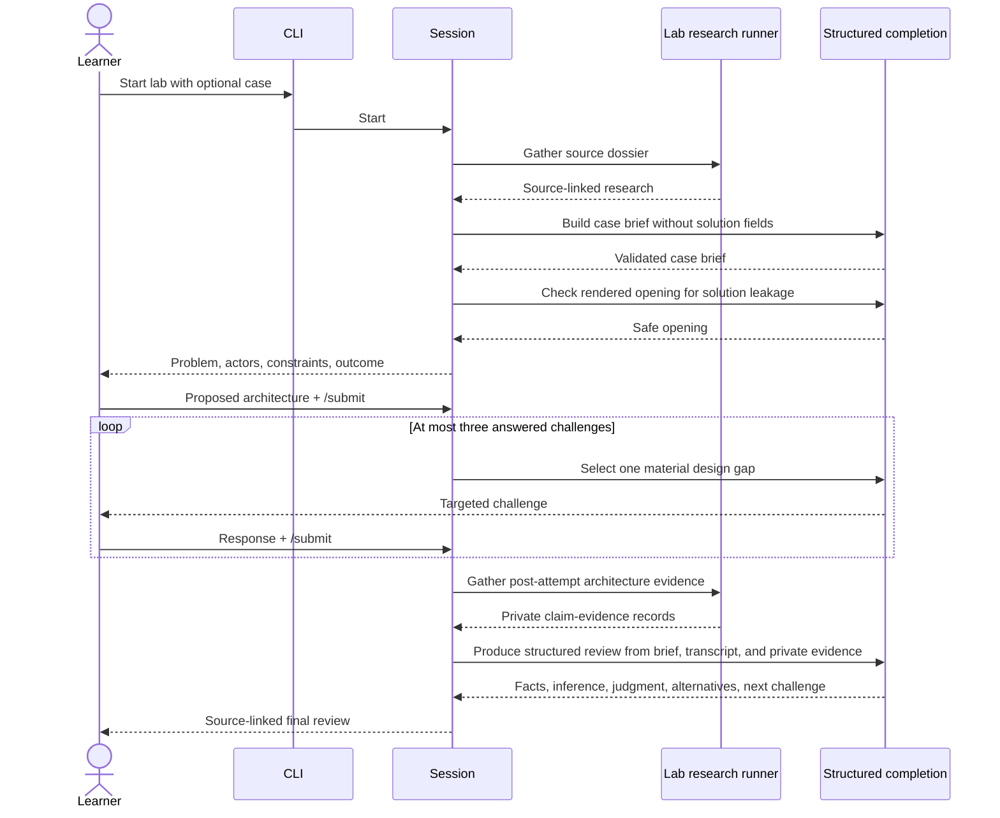

# Architecture Case Lab - Plan

## Goal Capsule

- **Objective:** A learner can practice designing the architecture of an impactful AI use case and receive a bounded, source-backed critique that improves architectural reasoning.
- **Means:** Add an interactive Architecture Case Lab that composes Birbal's existing research harness with typed learning phases and an application-owned session controller. (KTD1, KTD2)
- **Product authority:** The Product Contract defines the lab experience and preserves the existing reading-list workflow. The Planning Contract defines implementation mechanisms but cannot weaken the Product Contract.
- **Execution profile:** Standard software feature with host-neutral domain logic, one terminal adapter, and deterministic unit and integration coverage.
- **Stop conditions:** Stop implementation if an opening can bypass the pre-display leakage gate, the round cap is model-controlled, a lab session persists across invocations, or the existing research output contract changes.
- **Tail ownership:** Implementation owns code, tests, and documentation. No deployment or data migration tail is required.

---

## Product Contract

### Summary

This plan adds Architecture Case Lab as an isolated application workflow that reuses Birbal's research capabilities while keeping human interaction, learning policy, and session state behind narrow ports. The existing reading-list agent remains a separate non-interactive workflow.

### Problem Frame

Birbal currently turns a topic into a source-linked reading list and ends the run. That supports discovery but leaves the learner to convert reading into architectural understanding without practice or feedback.

Learning research favors active retrieval, scaffolded feedback, and learner explanation over passive review. The lab should use Birbal's research and tool loop to create that active practice without becoming a general tutor or an opaque grading system.

### Key Decisions

- **Architecture Case Lab is the next product capability.** (session-settled: user-directed — chosen over an evidence-first investigator and persistent architecture coach: it adds active practice while keeping the product focused.) Governs R1-R15.
- **The learner attempts the architecture before seeing researched solutions.** (session-settled: user-directed — chosen over research-first and collaborative design: it avoids answer leakage and tests reasoning.) Governs R3, R5, R7.
- **Case selection supports learner choice and an agent-selected default.** (session-settled: user-directed — chosen over either party always choosing: both intentional study and discovery remain possible.) Governs R1-R3.
- **The lab runs as one interactive terminal session.** (session-settled: user-directed — chosen over two-command and single-shot workflows: the learning loop remains immediate without cross-run persistence.) Governs R4-R8, R14.
- **The challenge loop is bounded at three rounds.** (session-settled: user-directed — chosen over an open-ended conversation and single critique: sessions have predictable depth and cost.) Governs R6-R8, R13.
- **The final assessment is qualitative and sourced.** (session-settled: user-directed — chosen over a numeric scorecard and reference-only comparison: evidence remains inspectable without claiming to measure mastery.) Governs R9-R12.

### Actors

- A1. **Learner:** Chooses or accepts a case, proposes an architecture, and responds to challenges.
- A2. **Birbal lab agent:** Researches the case, manages the bounded exercise, challenges the learner, and produces the final review.

### Requirements

**Case selection and setup**

- R1. The learner may name an AI use case or ask Birbal to select a recent impactful case.
- R2. An agent-selected case must be grounded in credible sources and present a concrete problem, affected actors, constraints, and desired outcome.
- R3. The opening challenge must not reveal a reference architecture, vendor implementation, or complete solution before the learner responds.

**Interactive learning loop**

- R4. The lab must keep temporary conversation context for one terminal session without requiring cross-run persistence.
- R5. The learner must be able to submit a proposed architecture in free-form text during the session.
- R6. Birbal must conduct no more than three challenge rounds after the initial proposal.
- R7. Each challenge must target a material design dimension raised by the proposal or case, such as control flow, tool boundaries, state, safety, evaluation, reliability, or human oversight.
- R8. A challenge must build on the learner's latest answer and must not replace the exercise with a complete generated solution.

**Final design review**

- R9. The final review must identify strengths, unresolved risks, missing components, and credible alternative choices in the learner's design.
- R10. The final review must distinguish source-supported facts, architectural inference, and Birbal's evaluative judgment.
- R11. The final review must cite the sources used to ground claims about the use case or comparable systems.
- R12. The final review must avoid a mastery score and finish with one concrete next learning challenge.

**Boundaries and compatibility**

- R13. Research activity and learner challenges must stay within explicit step, round, tool-timeout, and network-safety limits.
- R14. The learner may finish early or exit the lab, and the unfinished session must leave no durable learner state.
- R15. The existing reading-list workflow must remain available with its current non-interactive behavior and output contract.

### Session Flow



### Key Flows

- F1. Learner-supplied case
  - **Trigger:** A1 starts a lab with a named use case.
  - **Actors:** A1, A2
  - **Steps:** A2 researches the case, presents the problem and constraints without a solution, accepts A1's design, runs the bounded challenge loop, and produces the review.
  - **Outcome:** A1 receives feedback on an architecture they attempted before seeing researched alternatives.
  - **Covered by:** R1, R3-R13.
- F2. Agent-selected case
  - **Trigger:** A1 starts a lab without naming a use case.
  - **Actors:** A1, A2
  - **Steps:** A2 selects a sourced case, presents the challenge, and follows the same learner-first loop as F1.
  - **Outcome:** A1 encounters a relevant architecture problem they did not have to discover first.
  - **Covered by:** R1-R13.
- F3. Early finish or exit
  - **Trigger:** A1 asks for the review before the third round or exits the session.
  - **Actors:** A1, A2
  - **Steps:** A2 produces the best supported review possible when asked to finish, or terminates without persisting session state when the session is exited.
  - **Outcome:** The learner controls session length without creating incomplete durable records.
  - **Covered by:** R9-R14.

### Acceptance Examples

- AE1. Learner-selected challenge
  - **Covers R1, R3, R5.**
  - **Given:** The learner starts a lab about an AI customer-support agent.
  - **When:** Birbal presents the challenge.
  - **Then:** The prompt contains sourced problem context and constraints but no reference component design.
- AE2. Agent-selected challenge
  - **Covers R1-R3.**
  - **Given:** The learner starts a lab without a topic.
  - **When:** Birbal selects a case.
  - **Then:** The selected case has credible supporting sources and enough concrete context for an architecture attempt.
- AE3. Bounded challenge loop
  - **Covers R6-R8, R13.**
  - **Given:** The learner answers every challenge.
  - **When:** Three challenge rounds have completed.
  - **Then:** Birbal stops asking questions and produces the final review.
- AE4. Limited evidence
  - **Covers R2, R10, R11.**
  - **Given:** Birbal cannot verify an architectural claim about the selected case.
  - **When:** The claim matters to the final review.
  - **Then:** Birbal labels it as inference or limited evidence rather than presenting it as fact.
- AE5. Existing research behavior
  - **Covers R15.**
  - **Given:** The learner invokes the existing research workflow.
  - **When:** The run completes.
  - **Then:** Birbal returns the same reading-list-shaped result without entering an interactive lab.

### Success Criteria

- A complete session reaches a sourced final review after an initial design and no more than three challenge rounds.
- The learner can identify why a design choice is strong, risky, or incomplete from the review's evidence and reasoning.
- The lab demonstrates interactive human input, tool-backed research, bounded orchestration, and structured feedback without requiring persistent learner data.
- Existing reading-list behavior remains independently usable.

### Scope Boundaries

**Deferred for later**

- Persistent learner profiles, misconception histories, spaced review, and progress tracking.
- Reference-architecture comparison as a separate optional learning mode.
- Built-in saving, exporting, or resuming of completed lab sessions. Caller-controlled stdout capture remains available.

**Outside this product's identity**

- Numeric mastery scoring or automated certification.
- Classroom, teacher, cohort, or multi-user administration.
- A general-purpose tutor covering arbitrary subjects.
- Newsletter generation, publishing, or content-distribution workflows.

### Dependencies and Assumptions

- The terminal environment can collect learner input while one lab invocation remains active.
- Existing research tools can usually find enough credible material to frame a case, but the lab must handle limited evidence truthfully.
- The final review is an advisory learning aid rather than an authoritative architecture verdict.
- Birbal currently bounds agent steps and tool/network execution but does not provide caller-level cancellation for an entire agent run.

### Sources and Research

- Current Birbal product and harness behavior: `README.md`, `docs/agent-harness.md`, `docs/architecture.md`, `docs/operations.md`, and `docs/tools.md`.
- Scaffolded AI tutoring can support learning when the system controls progression and feedback: [Scientific Reports, 2025](https://www.nature.com/articles/s41598-025-97652-6).
- Retrieval practice improves later retention compared with additional study: [Roediger and Karpicke](https://pubmed.ncbi.nlm.nih.gov/16507066/).
- Unguarded generative assistance can improve practice performance while harming unassisted performance: [PNAS, 2025](https://doi.org/10.1073/pnas.2422633122).
- Retrieval can improve factual grounding, but source use and pedagogy remain separate concerns: [Retrieval-Augmented Generation](https://proceedings.neurips.cc/paper/2020/file/6b493230205f780e1bc26945df7481e5-Paper.pdf).

---

## Planning Contract

**Product Contract preservation:** Product Contract unchanged.

### Key Technical Decisions

- KTD1. **Keep the interactive lifecycle in an application-owned session controller.** (session-settled: user-directed — chosen over two-command and single-shot orchestration: the learning loop remains immediate without cross-run persistence.) The controller retains only invocation-local state and depends on host-neutral operations. The generic framework stays independent of terminal input. Governs R4-R8, R14, R15.
- KTD2. **Compose a lab-specific research runner from existing harness primitives.** The runtime reuses the model client, tool runner, rendered research tools, logger, and generic harness but does not reuse the configured reading-list agent or parse its Markdown. A pre-attempt prompt requests only problem framing, actors, constraints, evidence, and outcomes and returns a typed source dossier. Challenge and review generation use `completeStructuredWithRepair()` through narrow operations. This preserves R15 and avoids the reading-list prompt's implementation-detail bias. Governs R2, R3, R7-R12, R15.
- KTD3. **Gate the learner-first opening and preserve evidence categories.** The case-brief schema has fields for problem, actors, constraints, outcome, evidence quality, and sources but no architecture-specific field. A separate pre-display leakage check receives only the rendered opening and rejects reference designs, vendor implementations, and complete solution steps; an unsafe or uncheckable opening fails before display. Phase-specific prompting and adversarial rendered-opening tests remain defense in depth. The review schema separates supported facts, inference, and judgment and references validated source IDs instead of accepting new unverified citations. Governs R3, R8-R12.
- KTD4. **Let the controller own transitions, commands, and budgets.** (session-settled: user-directed — chosen over an open-ended conversation and single critique: a fixed controller makes depth and cost predictable.) Prompts choose cases, design dimensions, and qualitative feedback but cannot choose the next state. Setup research and post-attempt architecture research may each use eight harness steps. Case-brief extraction, the pre-display leakage check, up to three challenge completions, and final-review generation each permit the existing single repair attempt, for at most twenty-eight model passes on the normal worst-case path. Governs R6-R8, R13, R14.
- KTD5. **Keep evidence acceptance deterministic.** Automatic selection requires two HTTP(S) source URLs on distinct hostnames, one source dated within the previous 24 months against an injected clock, and an outcome claim linked to a dossier source. URL validity, dossier membership, hostname independence, recency, and source references are deterministic. A learner-supplied case may proceed with one credible source if the brief and review mark evidence as limited. Governs R1-R3, R10, R11.
- KTD6. **Use an event-backed terminal input adapter with one interruption ownership chain.** The adapter queues line events and latches EOF, SIGINT, and input errors as host-neutral outcomes. After displaying a case brief or challenge, the controller discards lines buffered before that newly visible turn and accepts subsequent lines in order. The CLI forwards interruption to the controller, the controller checks the latch after each uncancellable operation and discards that result, operations own typed research and model failures, and the CLI alone maps terminal outcomes to streams, status, and cleanup. Interactive material goes to stderr and only a completed final review goes to stdout. Governs R4, R5, R14, R15.
- KTD7. **Keep every stateful boundary fresh and operation-injected.** The runtime is the only concrete composition root. It shares model and research capabilities through narrow functions, while every lab factory call creates a new controller and transcript. The lab domain cannot import terminal APIs, the default runtime, provider selectors, tool registries, or concrete integration clients. Governs R4, R13-R15.
- KTD8. **Treat learner text and retrieved text as untrusted data.** Prompts delimit case evidence and transcript content. Structured schemas reject phase mismatches, the controller ignores model attempts to alter phase or output destination, and final-review citations must resolve to the validated case brief. Governs R3, R6-R11, R13.

### High-Level Technical Design

#### Component boundaries



The controller depends on ports and typed values. The default runtime binds those ports to a lab-specific research runner composed from the existing generic harness, model client, and tool graph. The CLI alone owns streams, exit status, and terminal cleanup.

#### Session state machine



Learner text entered after a visible case or challenge prompt is accumulated until an exact `/submit` line commits the turn. At each newly visible learner turn, the controller discards lines buffered before the prompt appeared so pasted input cannot answer an unseen question. Blank submissions, oversized drafts, and an early `/finish` before a proposal return the controller to the same waiting state without a model call. `/exit` and EOF are graceful exits. SIGINT becomes an interrupted terminal outcome after any active model call settles, and its result is discarded.

During setup or challenge generation, latched EOF discards the operation result and exits cleanly; during final-review generation, the completed review wins because no more learner input is required. An input error always wins over an operation result and produces failure. SIGINT wins in every active phase. An operation failure is reported unless EOF already selected a graceful exit during setup or challenge generation.

#### Evidence and learning sequence



### Output Structure

```text
src/app/architecture-lab/
  constants.ts
  evidence.ts
  operations.ts
  prompts.ts
  render.ts
  schemas.ts
  session.ts
  types.ts
src/app/terminal/
  readline.ts
  types.ts
prompts/
  system-architecture-case-lab.txt
tests/
  architecture-lab-operations.test.ts
  architecture-lab-session.test.ts
  terminal-input.test.ts
docs/
  architecture-case-lab.md
```

### Assumptions

- Node.js 22.13.0 is the minimum supported local runtime. The event and signal semantics in KTD6 are available in that version and later releases.
- Learner text may span lines and is accumulated until an exact trimmed, case-insensitive `/submit` line commits the turn. Exact `/finish` and `/exit` tokens are commands only when they are the entire line; `/finish` requires an empty draft so it cannot discard an active draft.
- A case argument is limited to 500 characters, each learner turn is limited to 8,000 characters, and the cumulative structured transcript is limited to 32,000 characters. Oversized input is rejected without advancing the session.
- The generic harness and existing research tools can produce a typed source dossier through a lab-specific prompt. When they cannot, the lab fails before presenting an unsupported case.
- Deterministic evidence checks cover URL validity, URL presence in the dossier, hostname independence, publication recency, and outcome-source references.
- In-flight caller cancellation remains unavailable. A terminal interrupt is latched during active model work and wins before the next learner prompt or output.

### Sequencing

Build the typed lab operations before the stateful controller so the controller can be tested against stable ports. Build and test the terminal adapter independently before wiring it through the runtime and CLI. Add documentation after the public command and output behavior are settled.

### System-Wide Impact

- **Agent and tool parity:** The lab reuses the same source-discovery capabilities as the research workflow. It adds no privileged research path or hidden vendor client.
- **Prompt context:** Case extraction alone sees the raw setup dossier. Challenge operations receive only the validated brief and ordered bounded transcript visible to the learner. Post-attempt research receives a bounded query derived from the attempted design, and only its validated claim-evidence records are added to final-review context.
- **Lifecycle:** Runtime creation remains the outer lifecycle boundary. Lab session creation becomes a nested, invocation-local lifecycle boundary with explicit terminal outcomes.
- **Failure propagation:** Research, model, schema, and input failures become typed terminal outcomes, expose no provider internals, and emit no partial final review. Recovery starts from a fresh invocation because checkpoint and resume are outside scope.
- **Human-only actions:** Only the learner can provide the initial proposal and challenge answers. No model operation may synthesize a missing learner turn to advance the controller.
- **CLI compatibility:** Default and `agent` commands remain non-interactive. Their stdout, stderr, trace, and task-default behavior are regression contracts.
- **Operations:** No database, file persistence, migration, background process, or externally visible publishing action is introduced.

### Risks and Mitigations

- **Answer leakage:** A model may include a known architecture inside a free-text setup field. Reduce the surface with a lab-specific pre-attempt research prompt and constrained schema, then verify rendered openings with implementation-heavy and adversarial dossier fixtures.
- **False evidence confidence:** A model may misclassify a source as primary or overstate impact. Mitigate with deterministic URL, hostname, date, and dossier-membership checks and visible limited-evidence labeling.
- **Prompt injection through sources or learner text:** Retrieved pages and learner answers may contain instructions. Mitigate with explicit data delimiters, phase-specific schemas, source-ID citation checks, and controller-owned transitions.
- **Cost multiplication:** A multi-turn lab can multiply model and tool calls. Mitigate with KTD4 budgets, transcript limits, and no retry beyond the existing single structured-output repair. The post-attempt evidence run happens only when a final review is requested.
- **Terminal hangs and leaked listeners:** Readline begins consuming input immediately and can outlive command work. Mitigate with an event-backed queue, one terminal outcome latch, and idempotent cleanup in `finally`.
- **Interrupt latency:** SIGINT cannot cancel an active model completion in this scope. Mitigate by latching interruption, discarding the in-flight result, documenting the limitation, and deferring caller-level abort propagation.

### Deferred to Follow-Up Work

- Caller-level `AbortSignal` propagation through model completion and the whole agent run.
- A generic persistent framework session primitive if another application workflow needs shared model history across human turns.
- A public headless or JSON lab adapter after the terminal workflow proves useful.

### Technical Research

- Existing composition and boundary patterns: `src/app/runtime/default.ts`, `src/app/runtime/types.ts`, `src/app/agent/run.ts`, `src/app/agent/prompts.ts`, `src/framework/llm/repair.ts`, and `tests/framework-boundaries.test.ts`.
- The Node.js API documents that readline starts consuming input when the interface is created, that EOF closes the interface, and that a final unterminated line is emitted before close: [Readline lifecycle](https://nodejs.org/download/release/v22.13.0/docs/api/readline.html#event-close) and [line events](https://nodejs.org/download/release/v22.13.0/docs/api/readline.html#event-line).
- The Node.js API documents distinct readline SIGINT behavior and the need to close an interface explicitly when a handler owns the signal: [Readline SIGINT](https://nodejs.org/download/release/v22.13.0/docs/api/readline.html#event-sigint).
- Node recommends `process.exitCode` over `process.exit()` when pending output must not be truncated: [Process exit guidance](https://nodejs.org/download/release/v22.13.0/docs/api/process.html#processexitcode).
- Commander 14 supports async action handlers through the existing `parseAsync()` path: [Commander action handlers](https://github.com/tj/commander.js/blob/v14.0.3/Readme.md#action-handler).

---

## Implementation Units

### U1. Add typed lab research and model operations

- **Goal:** Produce validated case briefs, targeted challenges, and final reviews through narrow operations while reusing the current research and structured-output infrastructure.
- **Requirements:** R1-R3, R7-R12; A2; F1, F2; AE1, AE2, AE4; KTD2, KTD3, KTD5, KTD8.
- **Dependencies:** None.
- **Files:** `prompts/system-architecture-case-lab.txt`, `src/app/architecture-lab/constants.ts`, `src/app/architecture-lab/types.ts`, `src/app/architecture-lab/schemas.ts`, `src/app/architecture-lab/prompts.ts`, `src/app/architecture-lab/evidence.ts`, `src/app/architecture-lab/operations.ts`, `tests/architecture-lab-operations.test.ts`.
- **Approach:**
  1. Define phase-specific request, success, and failure unions plus Zod schemas for the case brief, opening leakage check, challenge, private architecture evidence, and review.
  2. Compose a lab-specific tool-using research runner from the existing generic harness primitives and return a typed source dossier without changing the reading-list agent.
  3. Use `completeStructuredWithRepair()` for case extraction, the pre-display leakage check, challenge generation, and review generation with phase-specific trace labels and the existing model response options.
  4. Run a second bounded research operation only after the learner finishes, and validate its architecture claim-evidence records before adding them to final-review context.
  5. Keep phase prompts separate from the reading-list prompt and delimit all dossier and transcript text as data.
- **Patterns to follow:** `src/app/agent/prompts.ts` for bundled prompt loading, `src/framework/llm/repair.ts` for structured results, and `src/app/tools/types.ts` for operation-injected boundaries.
- **Test scenarios:**
  - Covers F1 / AE1. A named case builds a research request for that case and returns a brief with no reference-architecture field.
  - Covers F2 / AE2. An omitted case builds a discovery request and accepts a brief only when KTD5's evidence gate passes.
  - Covers AE4. A learner-supplied case with one credible source returns `limited` evidence and the renderer-facing data retains that label.
  - A valid challenge names one allowed design dimension and contains one question without a proposed solution.
  - A valid review separates supported facts, inference, and judgment and rejects any fact whose source ID is absent from the case brief.
  - Invalid JSON is repaired once; a second invalid response becomes a typed phase failure.
  - A model-provided citation URL absent from the research dossier is rejected.
  - A rendered opening flagged as a reference design, vendor implementation, or complete solution fails before any learner-facing output.
  - Prompt-injection-shaped dossier and learner text remain inside data delimiters and cannot change the requested phase schema.
  - The reading-list prompt, parser, and `runAgent()` result remain unchanged while lab research returns typed provenance and failures.
  - Post-attempt research runs only for a requested final review, returns bounded claim-evidence records, and cannot alter the learner transcript.
  - The bundled lab prompt loads outside the repository working directory.
- **Verification:** Fake research and model operations prove every phase result and failure without live network or provider calls.

### U2. Implement the bounded Architecture Lab session controller

- **Goal:** Enforce learner-first phase order, round limits, evidence policy, input bounds, early finish, and terminal outcomes without terminal or provider dependencies.
- **Requirements:** R3-R14; A1, A2; F1-F3; AE1-AE4; KTD1, KTD4, KTD5, KTD7, KTD8.
- **Dependencies:** U1.
- **Files:** `src/app/architecture-lab/session.ts`, `src/app/architecture-lab/render.ts`, `tests/architecture-lab-session.test.ts`.
- **Approach:**
  1. Represent lifecycle states and public outcomes as discriminated unions and reject invalid transitions before calling an operation.
  2. Store only the typed case brief, learner turns, challenge turns, round count, and terminal state inside each session instance.
  3. Accumulate multiline drafts until `/submit`, recognize exact control commands, validate input bounds, and let the controller select the next operation per KTD4.
  4. Render typed brief, challenge, review, progress, retry, and failure values without letting model text choose stdout, stderr, or exit status.
  5. Render explicit text headings for supported facts, architectural inference, evaluative judgment, evidence status, alternatives, and the next learning challenge; ANSI styling, if any, is redundant.
- **Execution note:** Implement lifecycle behavior test-first because stateful reuse and repeated calls are explicit repository risk areas.
- **Patterns to follow:** Factory-created state from `src/app/runtime/default.ts` and strict discriminated unions from `src/framework/agent/protocol.ts`.
- **Test scenarios:**
  - Covers F1 / AE1. A named case reaches `awaiting_proposal` and exposes no reference design.
  - U1's real case-extraction operation composed with U2's renderer keeps an implementation-heavy dossier from exposing a reference design, even when its source text contains one.
  - Covers F2 / AE2. An omitted case reaches the same state only after the automatic evidence gate passes.
  - Covers F3. `/finish` after a submitted proposal creates a review; `/finish` before a proposal or with a nonempty draft reprompts without a model call.
  - Covers AE3. Three answered challenges produce a review and a fourth challenge operation is impossible.
  - Multiline text entered after a visible prompt remains one draft until `/submit`; lines buffered before the case or challenge becomes visible are discarded and cannot become answers to unseen turns.
  - A blank submission or oversized draft returns a distinct corrective message with the applicable bound without changing state or round count.
  - Early `/finish` explains that a submitted proposal is required before review generation.
  - `/exit` and EOF end the session without a review or another model call.
  - `/finish` with a pending challenge records that dimension as unresolved in the review request.
  - A phase failure terminates once and later submissions cannot restart the instance.
  - A latched interruption discards an in-flight operation result and returns `interrupted`.
  - EOF, SIGINT, and input failure have defined outcomes from both learner-waiting states.
  - Challenge operations receive the exact validated brief and ordered transcript but never either raw dossier; review receives those values plus validated private claim-evidence records.
  - Research, challenge generation, post-attempt research, and review generation each emit one concise non-animated progress status before the operation begins.
  - Review sections remain distinguishable through text alone on TTY, non-TTY, and redirected output.
  - No phase operation can synthesize a learner proposal or challenge answer to advance the state.
  - Two sessions created from the same factory retain no shared transcript, round, or terminal state.
  - A transcript at the aggregate boundary is accepted and one character over is rejected before generation.
- **Verification:** A scripted fake operation port covers the complete transition table and asserts exact operation counts and options.

### U3. Add the Node terminal input adapter

- **Goal:** Convert Node readline events into ordered host-neutral input outcomes and guarantee cleanup across every terminal path.
- **Requirements:** R4, R5, R14; A1; F1-F3; KTD6, KTD7.
- **Dependencies:** None.
- **Files:** `src/app/terminal/types.ts`, `src/app/terminal/readline.ts`, `tests/terminal-input.test.ts`.
- **Approach:**
  1. Create the readline interface only for the `lab` command and attach line, close, SIGINT, and input-error listeners immediately.
  2. Maintain a FIFO line queue, at most one pending read, and one terminal-outcome latch.
  3. Drain queued lines before EOF, but let interruption and input errors preempt queued input.
  4. Expose a checkpoint operation that discards only lines buffered before a newly visible learner turn.
  5. Make cleanup idempotent, remove listeners, and ignore late events after termination.
  6. Enable terminal editing only when both stdin and the interaction output stream are TTYs.
- **Patterns to follow:** Injected I/O boundaries in `src/app/cli.ts` and deterministic stream replacement in the existing network tests.
- **Test scenarios:**
  - Lines buffered before a newly visible turn are discarded at its checkpoint; lines entered afterward remain ordered and are returned once, allowing the controller to assemble them until `/submit`.
  - A final unterminated line is returned before EOF.
  - EOF resolves a pending read and never becomes an empty learner turn.
  - SIGINT preempts queued lines and is not overwritten by the following close event.
  - An input error becomes a failure rather than EOF.
  - Late line events after termination are ignored.
  - Repeated cleanup is harmless and listener counts return to baseline across repeated adapters.
  - Non-TTY streams produce deterministic output without terminal escape sequences.
- **Verification:** Stream and fake-interface tests finish with no open handles and prove event precedence without a live terminal.

### U4. Compose the lab runtime and CLI workflow

- **Goal:** Expose `lab [case...]` through the existing composition root while preserving default and `agent` behavior byte-for-byte at their public boundaries.
- **Requirements:** R1, R4-R6, R13-R15; F1-F3; AE3, AE5; KTD1, KTD4, KTD6, KTD7.
- **Dependencies:** U1, U2, U3.
- **Files:** `src/app/runtime/types.ts`, `src/app/runtime/default.ts`, `src/app/cli.ts`, `tests/runtime-default.test.ts`, `tests/cli-import-order.test.ts`, `tests/framework-boundaries.test.ts`.
- **Approach:**
  1. Construct the shared model client, tool executor, existing reading-list agent, separate lab research runner, and lab operation adapter once per runtime, then expose a factory that creates a fresh lab session per invocation.
  2. Add the explicit lab subcommand without changing the root or `agent` action paths.
  3. Drive session outputs, including non-animated progress text, through injected interaction and final-output writers, close the terminal adapter in `finally`, and map completed or exited to status 0, interrupted to 130, and failures to 1.
  4. Add an executable import boundary that prevents the lab domain from importing the CLI, terminal adapter, default runtime, provider selection, tool registry, or concrete clients.
- **Execution note:** Add compatibility assertions before changing CLI routing so the existing non-interactive contract is characterized.
- **Patterns to follow:** Lazy runtime import and dependency injection in `src/app/cli.ts`, fresh graph composition in `src/app/runtime/default.ts`, and AST-based boundary tests in `tests/framework-boundaries.test.ts`.
- **Test scenarios:**
  - Covers AE5. Default and `agent` invocations never construct an input adapter and preserve their reading-list stdout and trace stderr behavior.
  - Covers F1. `lab` joins a multiword case argument once and passes it to a fresh session.
  - Covers F2. `lab` without a case starts automatic selection.
  - Covers F3. `/exit` and EOF produce no stdout and leave status 0.
  - A completed or early-finished lab writes exactly one final review to stdout and writes setup, challenges, prompts, and warnings only to stderr.
  - SIGINT during learner input returns status 130; SIGINT during an active operation discards its result before any new output.
  - During setup or challenge generation, EOF discards a successful result and exits with status 0; during final-review generation, a successful review is rendered despite EOF.
  - Input errors beat active-operation results and fail with status 1; SIGINT beats completion, EOF, queued input, and operation failure according to KTD6.
  - Input or phase failure writes one actionable stderr message, sets status 1, and still closes the adapter.
  - Help lists `lab` while retaining the existing research descriptions and options.
  - Repeated runtime session factories return distinct controller instances while sharing no transcript state.
  - The architecture-lab import-boundary rule reports no forbidden dependency.
- **Verification:** In-process CLI tests prove routing and channels; one subprocess smoke test proves EOF returns the shell prompt without an open handle.

### U5. Document the learning workflow and compatibility boundary

- **Goal:** Make the lab discoverable and explain how its architecture demonstrates research, structured outputs, human turns, bounded orchestration, and loose coupling.
- **Requirements:** R1, R4, R9-R15; AE5.
- **Dependencies:** U4.
- **Files:** `README.md`, `docs/index.md`, `docs/cli.md`, `docs/architecture.md`, `docs/testing.md`, `docs/SUMMARY.md`, `docs/architecture-case-lab.md`.
- **Approach:** Document invocation, learner controls, stdout and stderr behavior, evidence labels, limits, no-persistence behavior, interrupt limits, component boundaries, and the unchanged reading-list command.
- **Patterns to follow:** Concise command examples in `README.md` and the focused documentation map in `docs/SUMMARY.md`.
- **Test scenarios:** Test expectation: none -- this unit changes documentation only; command and behavior claims are already proven by U4.
- **Verification:** Every documented command, control token, output channel, and limitation matches the tested public contract.

---

## Verification Contract

| Gate                  | Command or activity                                                                                                                                 | Proves                                                                                                |
| --------------------- | --------------------------------------------------------------------------------------------------------------------------------------------------- | ----------------------------------------------------------------------------------------------------- |
| Formatting            | `pnpm format:check`                                                                                                                                 | New TypeScript, prompts, tests, and Markdown follow repository formatting.                            |
| Static analysis       | `pnpm lint`                                                                                                                                         | New state and adapter code follows lint rules.                                                        |
| Types                 | `pnpm typecheck`                                                                                                                                    | Session unions, schemas, ports, and runtime integration are type-safe.                                |
| Lab operations        | `pnpm exec tsx --test tests/architecture-lab-operations.test.ts`                                                                                    | Research staging, schema repair, evidence validation, and prompt boundaries.                          |
| Session controller    | `pnpm exec tsx --test tests/architecture-lab-session.test.ts`                                                                                       | State transitions, limits, commands, failures, and fresh-session behavior.                            |
| Terminal and CLI      | `pnpm exec tsx --test tests/terminal-input.test.ts tests/cli-import-order.test.ts tests/runtime-default.test.ts tests/framework-boundaries.test.ts` | Event ordering, cleanup, command routing, composition, and loose-coupling rules.                      |
| Full regression       | `pnpm test`                                                                                                                                         | Existing research, agent, tool, provider, network, and CLI contracts remain green.                    |
| Complete quality gate | `pnpm check`                                                                                                                                        | The repository's full format, lint, type, and test contract passes in order.                          |
| Real terminal smoke   | Run `pnpm cli -- lab` and a named-case variant with a configured model and search provider                                                          | Ctrl-D, Ctrl-C, `/finish`, `/exit`, stdout pipeability, and normal shell return behave as documented. |

### Behavioral Verification Matrix

- **Learner-first setup:** Inspect the rendered setup for a named and automatic case. It contains sourced context but no reference architecture. Covers AE1 and AE2.
- **Normal bounded loop:** Submit a proposal and answer three challenges. The next visible result is the review, not a fourth challenge. Covers AE3.
- **Early completion:** Enter a multiline proposal, submit it with `/submit`, answer zero or more challenges, then enter `/finish`. The review calls out unanswered dimensions rather than inventing learner answers. Covers F3.
- **Evidence transparency:** Use a supplied case with limited evidence. Facts cite the brief, and unsupported claims remain inference or judgment. Covers AE4.
- **Compatibility:** Run the default and explicit research commands. Neither reads stdin or changes the reading-list result shape. Covers AE5.
- **Terminal outcomes:** Exercise `/exit`, EOF, SIGINT, and an injected input error. Confirm output channels, exit status, cleanup, and absence of durable state.

---

## Definition of Done

### Global Completion

- The lab satisfies R1-R15 and the acceptance examples without modifying their product meaning.
- The controller, not the model, enforces phase order, learner controls, evidence gates, transcript bounds, and the three-round cap.
- The setup schema reduces the architecture-leakage surface, and every rendered opening passes a pre-display leakage check. Adversarial fixtures prove the failure path. Review facts cannot cite sources outside the validated setup or post-attempt evidence records.
- Every terminal outcome has deterministic stdout, stderr, exit-status, and cleanup behavior.
- Default and explicit research commands remain non-interactive and reading-list-shaped.
- All verification gates pass, including the environment-dependent real-terminal smoke when credentials are available.
- Documentation describes the shipped behavior and limitations.
- No abandoned abstraction, temporary probe, duplicated prompt policy, or dead experimental code remains in the diff.

### Unit Completion

- **U1:** Typed phase operations produce only schema-valid, source-checked values or typed failures.
- **U2:** The transition table and lifecycle tests prove all normal, early, invalid, failed, and repeated-call paths.
- **U3:** The input adapter drains, interrupts, errors, and closes without hangs or listener leaks.
- **U4:** Runtime and CLI integration expose the lab and preserve the existing workflow and architectural boundaries.
- **U5:** User and architecture documentation match verified command behavior.
